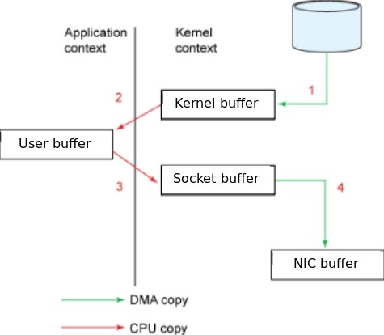
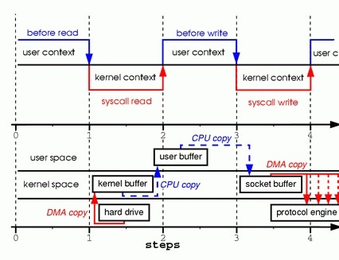

## Background

Consider the scenario of reading from a file and transferring the data to another program over the network. This scenario describes the behaviour of many server applications, including Web applications serving static content, FTP servers, mail servers, etc. The core of the operation is in the following two calls:

```c
read(file, user_buffer, len);
write(socket, user_buffer, len);
```

\*file and socket are two file descriptors.

Figure 1 shows how data is moved from the file to the socket.



Behind these two calls, the data has been copied at least four times, and almost as many user/kernel context switches have been performed. Figure 2 shows the process involved. The top side shows context switches, and the bottom side shows copy operations.



Step one: The read system call causes a context switch from user mode to kernel mode. The first copy is performed by the DMA (Direct Memory Access) engine, which reads file contents from the disk and stores them into a kernel address space buffer.

Step two: Data is copied from the kernel buffer into the user buffer, and the read system call returns. The return from the call causes a context switch from kernel back to user mode. Now the data is stored in the user address space buffer, and it can begin its way down again.

Step three: The write system call causes a context switch from user mode to kernel mode. A third copy is performed to put the data into a kernel address space buffer again. This time, though, the data is put into a different buffer, a buffer that is associated with sockets specifically.

Step four: The write system call returns, creating our fourth context switch. Return from write call does not guarantee the start of the transmission. It simply means the Ethernet driver had free descriptors in its queue and has accepted our data for transmission. Independently and asynchronously, a fourth copy happens as the DMA engine passes the data from the kernel buffer to the protocol engine. (The forked DMA copy in Figure 2 illustrates the fact that the last copy can be delayed).
As you can see, a lot of data duplication happens in this process. Some of the duplication could be eliminated to decrease overhead and increase performance. To eliminate overhead, we could start by eliminating some of the copying between the kernel and user buffers.
